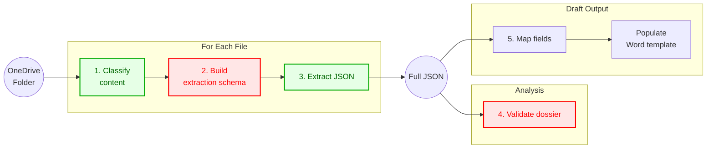

# Cittadinanza Pipeline

This repository contains the prompt and validation assets for a Copilot Studio Flow that processes citizenship case files and produces structured outputs used to support sentence drafting.

The flow is built around compiled prompt files in [prompts/compiled](prompts/compiled). Those prompts are generated from source prompts in [prompts](prompts) by replacing `{{...}}` placeholders with the contents of local Python and JSON files.

## What The Flow Does

The pipeline takes as input a OneDrive folder containing all PDFs for a case. The flow collects the documents in that folder, analyzes them as a single dossier, extracts and validates the relevant information, and finally uses the mapped output to fill a Word template containing a sentence draft.

Operationally, the pipeline runs through five logical stages:

1. Classify the document blocks found in the input.
2. Build the extraction schema for the document types that were detected.
3. Extract structured JSON from the source material.
4. Validate the extracted dossier against legal and procedural checks.
5. Map the validated result into a final output structure used to populate the Word sentence template.

The domain is recognition of Italian citizenship claims, with a specific focus on dossiers that may include:

1. `IndiceProcedimento.html`
2. `Ricorso`
3. `Procura`
4. `Atto di morte`
5. `Certificato Negativo di Naturalizzazione`
6. `Atto di nascita`
7. `Apostille`
8. `Traduzione`
9. `Asseverazione`

## Pipeline Stages

### 1. Content Classification

Prompt: [prompts/compiled/1_classify_content.txt](prompts/compiled/1_classify_content.txt)

Purpose:

1. Split an incoming PDF into logical document blocks.
2. Recognize which supported document types are present.
3. Return a JSON array of numeric document-type codes.

Important behavior:

1. Accessory documents such as apostilles, translations, and asseverations are included only when they belong to one of the supported primary documents.
2. Irrelevant procedural documents such as Avvocatura filings or sentence notes are ignored.

Output shape:

1. A JSON array of numeric identifiers.

### 2. Instruction Mapping

Prompt: [prompts/compiled/2_map_instructions.txt](prompts/compiled/2_map_instructions.txt)

Purpose:

1. Convert the list of detected document-type codes into a concrete extraction target.
2. Embed and execute the template generator defined in [src/templates.py](src/templates.py).

Supporting file:

1. [src/templates.py](src/templates.py) defines the JSON schema template for each supported document type.

Output shape:

1. A JSON list of document templates describing exactly what the extraction stage must return.

### 3. Data Extraction

Prompt: [prompts/compiled/3_extract_data.txt](prompts/compiled/3_extract_data.txt)

Purpose:

1. Extract structured data from the input documents.
2. Populate the target schema produced in stage 2.
3. Normalize dates and document-specific fields.

Important behavior:

1. The prompt contains detailed legal-domain definitions for each document type.
2. The target output is a JSON list of extracted documents.
3. Accessory documents are linked only when they belong to supported primary documents.

Output shape:

1. A JSON array of extracted documents, each with `document_type` and `schema`.

### 4. Dossier Analysis And Validation

Prompt: [prompts/compiled/4_analyse_data.txt](prompts/compiled/4_analyse_data.txt)

Purpose:

1. Run deterministic validation logic on the extracted JSON.
2. Produce a structured report of checks, failures, and reasons.

Supporting file:

1. [src/analysis.py](src/analysis.py) defines `DocumentValidator`.

What `DocumentValidator` checks:

1. Presence of the required documents.
2. Consistency of the ricorso, lineage, and ricorrenti.
3. Procura completeness, signatures, lawyers, translations, and apostilles.
4. Avo birth and death conditions.
5. Naturalization certificate consistency.
6. Descendant birth-document consistency.
7. KO tracking and reason reporting.

Output shape:

1. A JSON object with sections `0` through `11`.
2. Section `10` lists the KO questions.
3. Section `11` maps each KO to its explanation.

### 5. Final Output Mapping

Prompt: [prompts/compiled/5_map_data.txt](prompts/compiled/5_map_data.txt)

Purpose:

1. Transform the validator output into the final JSON expected by downstream sentence-generation logic.
2. Map fields such as parties, avo details, intervention text, Ministry presence, and final declarations.

Supporting file:

1. [src/mapping.json](src/mapping.json) defines the target keys and their intended meaning.

Output shape:

1. A flat JSON object used to fill placeholders in the final Word sentence template.

Word template currently used by the flow:

1. [res/Modello Cittadinanza per Copilot.docx](res/Modello%20Cittadinanza%20per%20Copilot.docx)

## Architecture

The end-to-end flow can be represented as follows:



Nodes in green injest a pdf file (LLM directly parse the content so OCR is not required), nodes in red contain exacutable Python code to enforce determinism. 

At a high level:

1. The OneDrive folder is the case boundary.
2. All PDFs in that folder contribute to the same dossier.
3. Prompt stages progressively move from unstructured text to a structured and validated case representation.
4. The final mapped JSON is not the end product by itself; it is the data source for the Word template that produces the draft sentence.
5. This flow does not rely on a separate OCR preprocessing stage in this repository documentation; document content is fed directly to the prompt stages.

## Prompt Compilation

The source prompts in [prompts](prompts) are not the files used directly by the Copilot Studio Flow.

Instead, the flow uses the compiled prompt files in [prompts/compiled](prompts/compiled), which are generated by replacing placeholders such as:

```text
{{src/templates.py}}
{{src/analysis.py}}
{{src/mapping.json}}
```

with the current contents of those files.

Compiler files:

1. [prompt_compiler.py](prompt_compiler.py)
2. [compile_prompts.py](compile_prompts.py)

Run the compiler locally:

```bash
python compile_prompts.py
```

That command regenerates all files under [prompts/compiled](prompts/compiled).

## Repository Structure

Key files and folders:

1. [prompts](prompts): source prompt fragments with placeholders.
2. [prompts/compiled](prompts/compiled): compiled prompt files used by the flow.
3. [src/templates.py](src/templates.py): extraction template generator.
4. [src/analysis.py](src/analysis.py): validator logic for extracted dossiers.
5. [src/mapping.json](src/mapping.json): final output mapping contract.
6. [res/Modello Cittadinanza per Copilot.docx](res/Modello%20Cittadinanza%20per%20Copilot.docx): Word template populated with stage 5 output.
7. [prompt_compiler.py](prompt_compiler.py): prompt compiler implementation.
8. [compile_prompts.py](compile_prompts.py): CLI entrypoint for compilation.
9. [test/test_analysis.py](test/test_analysis.py): validator tests.
10. [test/test_prompt_compiler.py](test/test_prompt_compiler.py): prompt compiler tests.

## Running Tests

Run the full test suite:

```bash
python -m unittest discover -s test -v
```

Run only the prompt compiler tests:

```bash
python test/test_prompt_compiler.py
```

Run only the validator tests:

```bash
python test/test_analysis.py
```

## Generate Synthetic Fascicoli (With PDFs)

To stress test extraction and analysis, you can generate synthetic dossiers that include:

1. Multiple logical documents packed into a single PDF (or split into bundles).
2. Relevant and irrelevant documents mixed together.
3. Multiple apostilles in the same PDF, including apostilles that intentionally refer to unsupported documents.
4. Full accessory chains on irrelevant documents (e.g. marriage certificate + translation + apostille + apostille of translation).
5. Descendants with surname changes (e.g. after marriage) to test name-matching resilience.

Install generator dependency:

```bash
pip3 install -r requirements.txt
```

Generate synthetic cases:

```bash
python3 generate_synthetic_fascicoli.py --count 6 --seed 42
```

Optional output directory:

```bash
python3 generate_synthetic_fascicoli.py --output-dir res/synthetic_fascicoli_custom --count 10 --seed 99
```

Generated output is split into two parallel branches under the selected output directory:

1. `fascicoli/`: contains only generated PDFs.
2. `support/`: contains only support JSON files.

For each case, paths are aligned by case name:

1. `fascicoli/fascicolo_sintetico_XXX/`: one or more mixed-content PDF files (`*_bundle_XX.pdf`).
2. `support/fascicolo_sintetico_XXX/expected_extraction.json`: expected structured extraction output (ground truth for supported document types only).
3. `support/fascicolo_sintetico_XXX/mixed_logical_docs.json`: all logical source documents used to compose PDFs, including noise.
4. `support/fascicolo_sintetico_XXX/manifest.json`: scenario settings and PDF-to-logical-document mapping.

This lets you benchmark extraction quality by comparing your extracted output from PDFs against `expected_extraction.json`, and then pass the extracted output into the validator pipeline.

Note: `expected_extraction.json` intentionally excludes unsupported documents and their accessory chains (for example, marriage-certificate translation/apostille chains), even when those are present in the generated PDFs.

Rendering notes:

1. Every logical document starts on a new PDF page.
2. Pages are rendered in scan-like style (background noise, scanner streaks, stamps, jitter, and form-like text layouts) to make extraction less trivial than plain JSON text dumps.

## Automation

The repository includes two safeguards to keep compiled prompts aligned with source files.

### Local Pre-Push Hook

Tracked hook: [.githooks/pre-push](.githooks/pre-push)

Behavior:

1. Runs `python3 compile_prompts.py` before push.
2. Fails the push if [prompts/compiled](prompts/compiled) changed and those updates have not been committed.

Enable it in a local clone:

```bash
git config core.hooksPath .githooks
```

### GitHub Actions

Workflow: [.github/workflows/tests.yml](.github/workflows/tests.yml)

Behavior on push and pull request:

1. Checks out the repository.
2. Sets up Python.
3. Regenerates the compiled prompts.
4. Fails if the compiled files are out of date.
5. Runs the test suite.

## Copilot Studio Flow Integration

This repository is designed to support a Copilot Studio Flow rather than a standalone application.

Recommended usage inside the flow:

1. Accept a OneDrive folder reference as the flow input.
2. Enumerate all PDF files in that folder.
3. Feed document content directly into prompt invocations for stage 1 and stage 3.
4. Store and version the source prompts in [prompts](prompts).
5. Compile them before release or push.
6. Use the compiled prompt files from [prompts/compiled](prompts/compiled) when configuring prompt nodes in Copilot Studio.
7. Use code execution inside prompt invocations where required by the compiled prompts.
8. Keep the Python-backed logic embedded via compilation so prompt definitions and business rules remain versioned together.

In practice, the flow can be modeled as:

1. OneDrive trigger or manual folder selection.
2. File listing for all PDFs inside the folder.
3. Direct document-content handoff to prompt stages.
4. Prompt node for classification.
5. Prompt node for schema mapping with embedded code execution.
6. Prompt node for extraction.
7. Prompt node for validation with embedded code execution.
8. Prompt node for final field mapping.
9. Word template population.
10. Draft sentence storage or delivery.

## Maintenance Rule

Whenever you change any of these files:

1. [prompts](prompts)
2. [src/templates.py](src/templates.py)
3. [src/analysis.py](src/analysis.py)
4. [src/mapping.json](src/mapping.json)
5. [prompt_compiler.py](prompt_compiler.py)

you should rerun:

```bash
python compile_prompts.py
```

and commit the resulting updates in [prompts/compiled](prompts/compiled).